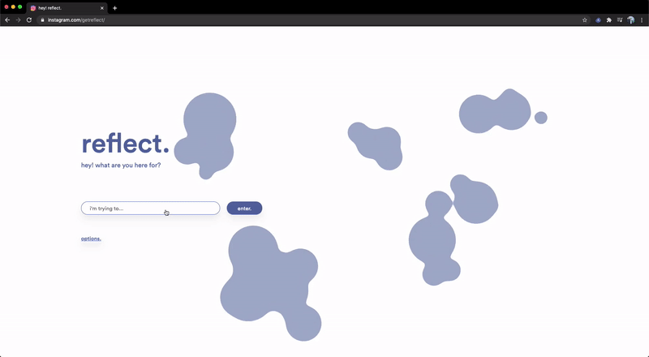

<p align="center">
    <h1 align="center" >reflect.</h1>
    <p align="center">
        "a mindful website blocker for the productive."
    </p>
    <div align="center">
        <a href="https://getreflect.app/">Learn More</a> | <a href="https://chrome.google.com/webstore/detail/reflect-a-mindful-website/bicebchdpeichdlmoaflplakefkjkade">Install for Chrome</a> | <a href="https://addons.mozilla.org/en-US/firefox/addon/reflect-app/">Install for Firefox</a>
    </div>
    <br />
    
</p>

reflect is a digitally mindful chrome extension that encourages users to reflect on their relationship with technology.

when you attempt to visit distracting websites, reflect will ask you what your intention in doing so is. if you have a valid reason, you are allowed to enter the website; if not, you are encouraged to reflect further.

## Building the project
1. Install the package dependencies by doing `npm i`
2. Run `npm run build`
3. Load the extension in the Chrome Extensions menu
   * Go to extensions > enable developer mode (top right corner)
   * Click load unpacked, select the `dist` folder
## Developing
When developing, you will likely want to use a different workflow that is slightly faster. This assumed you already 1) Have all the dependencies installed 2) Have run `npm run build` once already and 3) Have the extension installed

1. Run `npm run watch`
2. Reload extension in the Chrome Extensions menu
   * Go to extension > under reflect, press the refresh icon

## Directory

A brief overview of the file structure in the repository,

```python
┏╼╾src # holds the source code for the extension (typescript)
╏  ┣╼╾background.ts # handles intent classification, setup, whitelist, etc.
╏  ┣╼╾content.ts # injected into every page, actual block page
╏  ┣╼╾contextMenus.ts # create chrome right click context menu
╏  ┣╼╾nn.ts # tokenizer and classifier class implementation
╏  ┣╼╾options.ts # handle site block changes
╏  ┗╼╾util.ts # random util functions
┣╼╾build # stores intermediate js files compiled from ts [GENERATED]
╏  ┣╼╾background.js
╏  ┣╼╾content.js       # as these are generated, you shouldn't be
╏  ┣╼╾contextMenus.js  # editing these if you need the change
╏  ┣╼╾nn.js            # functionality, do it in `src/`
╏  ┣╼╾options.js
╏  ┗╼╾util.js
┣╼╾dist # distribution folder, select this when loading as extension
╏  ┣╼╾res # resources folder
╏  ╏  ┣╼╾models # stores converted keras models (jackyzha0/reflect-nlp/nlp)
╏  ╏  ╏  ┣╼╾acc%%.%% # where %%.%% represents accuracy on the test set
╏  ╏  ╏  ╏  ┣╼╾group1-shar1of1.bin # binary storage of model weights
╏  ╏  ╏  ╏  ┣╼╾model.json # stores architecture of model
╏  ╏  ╏  ╏  ┗╼╾tokenizer.json # stores word tokenizer mappings
╏  ╏  ╏  ┗╼╾...
╏  ╏  ┣╼╾pages # html files
╏  ╏  ╏  ┣╼╾options.html # page to edit website whitelist
╏  ╏  ╏  ┗╼╾prompt.html # actual block page
╏  ╏  ┗╼╾... # misc. svg files, fonts, css, and images
╏  ┣╼╾src # final source code, generated from `npm run build` [GENERATED]
╏  ┣╼╾jquery-3.4.1.min.js # jquery source code, used for DOM manipulation
╏  ┣╼╾jquery-ui.min.js # jquery ui source code, used for animations
╏  ┗╼╾manifest.json # for chrome to figure out what the extension does/needs
┣╼╾tsconfig.json # config for how typescript compiles to javascript
┣╼╾README.md # this file
┗╼╾package.json # tells npm about the project and how to build it
```

### Using different intent classifiers

You can find the latest models on our NLP repository here [https://github.com/jackyzha0/reflect-nlp](https://github.com/jackyzha0/reflect-nlp) inside the `nlp` folder. To convert a model, just run `./convert_to_js.sh <model_name>` and drop the result into `dist/res/models/` and call it in `src/background.ts`:

```typescript
// Load ML model stuff
const model: IntentClassifier = new IntentClassifier('acc84.78')
```